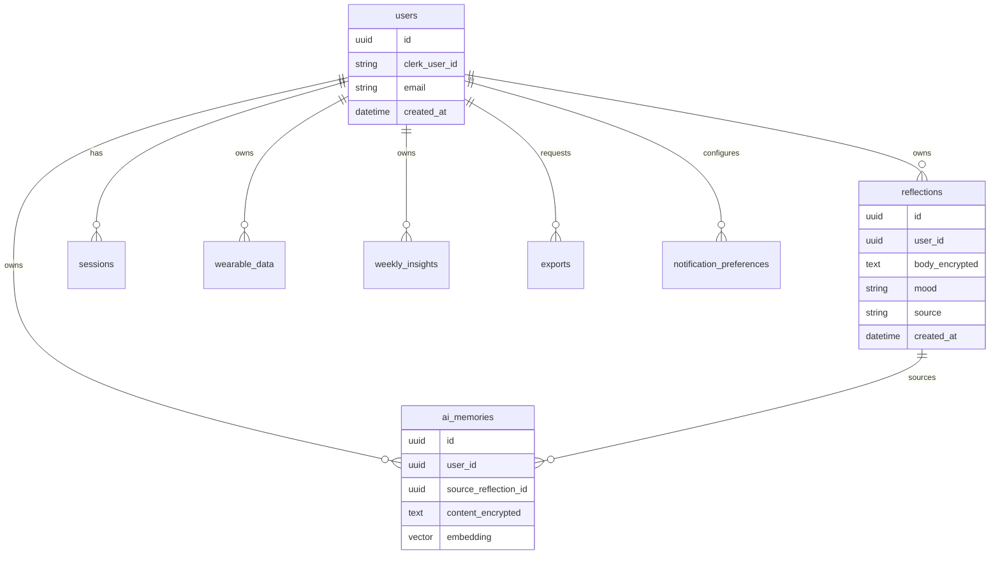

# ER Diagram

```mermaid
erDiagram
  users ||--o{ reflections : owns
  users ||--o{ sessions : has
  users ||--o{ wearable_data : owns
  users ||--o{ ai_memories : owns
  users ||--o{ weekly_insights : owns
  users ||--o{ exports : requests
  users ||--o{ notification_preferences : configures
  reflections ||--o{ ai_memories : sources

  users {
    uuid id
    string clerk_user_id
    string email
    datetime created_at
  }

  reflections {
    uuid id
    uuid user_id
    text body_encrypted
    string mood
    string source
    datetime created_at
  }

  ai_memories {
    uuid id
    uuid user_id
    uuid source_reflection_id
    text content_encrypted
    vector embedding
  }
```
