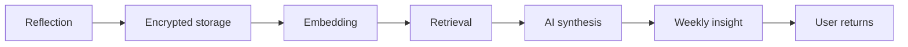

# Stage 1: Internal Stabilization

Goal: stable working alpha.

Target timeline: 1-3 weeks.

## Exit Criteria

- Apple login works.
- Google login works.
- Sessions persist across app restarts.
- Reflection creation works.
- Reflection storage works.
- AI synthesis returns a non-generic result.
- Memory retrieval works.
- Weekly insight generation works.
- Account deletion flow exists.
- Privacy policy is accessible in app and on web.
- No reflection text appears in logs or analytics.

## Core Loop

## Stabilization Test Script

Run this before inviting alpha users:

1. Create a new account with Apple.
2. Create a new account with Google.
3. Write three reflections on different days or mocked timestamps.
4. Search for a phrase that should retrieve one reflection.
5. Generate a weekly insight.
6. Delete the account.
7. Confirm user records, reflections, memories, and exports are removed or queued for deletion.

## Quality Bar

The first alpha does not need final UI. It does need a coherent emotional experience. The app should feel calm, restrained, observant, and trustworthy.
